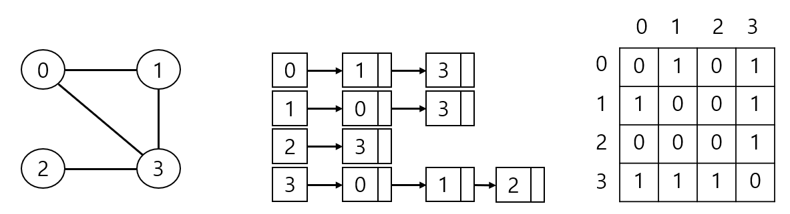

**배열(Array)**

* 배열의 데이터를 조회하는 경우 : O(1)
* 배열의 마지막에 삽입하거나 삭제하는 경우 : O(1)
* 배열의 마지막에 삽입하는데 가득 차 있는 경우 : 공간을 확보하고 기존의 배열을 모두 복사하고 새로운 데이터를 추가하므로 O(n)이지만 분할 상환 분석으로는 O(1)
* 배열의 중간에 삽입하거나 삭제하는 경우 : 기존 요소들을 옮기고 삽입·삭제하므로 O(n)

 

 

**연결 리스트(Linked list)**

* 노드(node)는 데이터와 링크로 구성됨.
* 연결 리스트에 데이터를 조회하는 경우 : O(n)
* 연결 리스트에 삽입하거나 삭제하는 경우 : O(1)

 

 

**스택(Stack)**

* First In Last Out, Last In First Out
* 파이썬에서는 리스트를 이용해 스택처럼 사용할 수 있음.
* 리스트의 append()를 스택의 push()로, 리스트의 pop()을 스택의 pop()으로 대체 가능.
* append()와 pop() : O(1)

 

 

**큐(Queue)**

* First In First Out
* front가 맨 앞의 데이터를 가리키고 rear가 맨 뒤의 데이터를 가리킴.
* 큐를 구현하는 방법
* 1. 리스트
  2. collections 모듈의 deque 클래스(from collections import deque)
  3. queue 모듈의 Queue 클래스(from queue import Queue)

 

리스트로 큐를 구현

* 리스트의 append()를 큐의 enqueue()로, pop(0)을 큐의 dequeue()로 사용.
* append()는 O(1)이지만 pop(0)이 O(n)

 

collections 모듈의 dequeue 클래스로 큐를 구현

* append()를 큐의 enqueue()로, popleft()를 큐의 dequeue()로 사용.
* popleft() : O(1)
* 내부적으로 연결 리스트를 사용하므로 데이터 조회시 O(n)

 

queue 모듈의 Queue 클래스로 큐를 구현

* put()을 큐의 enqueue()로, get()을 큐의 dequeue()로 사용.
* put(), get() : O(1)
* 데이터 조회시 O(n)

 

**원형 큐(Circular Queue)**

* 큐의 pop() 연산이 O(n)인 문제(dequeue 연산마다 모든 데이터를 한칸씩 앞으로 이동시켜야함)를 해결한 방식.
* dequeue 연산시 front를 뒤로 한칸만 이동시켜서 해결.
* enqueue 연산시 rear가 맨 뒤에 도착했을때 동적 배열의 맨 앞을 가리키게함.

 

 

**데크(Double-ended Queue)**

* 스택과 큐를 일반화한 것으로 front와 rear 모두에서 입출력이 가능.
* from collections import deque
* append()는 rear에 입력하는 것, pop()은 rear를 출력하는 것.
* insert(0, X)는 front에 입력하는 것, pop(0)은 front를 출력하는 것.
* append()와 pop() : O(1)
* insert(0, X)와 pop(0) : O(n)
* append(), appendleft(), pop(), popleft()

 

 

**그래프(Graph)**

* 정점(vertex)(노드)의 집합인 V(G)와 엣지(edge)의 집합인 E(G)로 정의됨(G = (V, E)).
* 무방향 그래프(undirected graph)에서 노드의 개수가 n개일때 최대 엣지의 개수는 n * (n - 1) / 2개.
* 방향 그래프(directed graph)에서 노드의 개수가 n개일때 최대 엣지의 개수는 n* (n-1)개.
* 차수(degree) : 노드의 엣지 개수.
* 방향 그래프는 진입 차수(in-degree)와 진출 차수(out-degree)로 구성되는데 이를 합친 것을 차수라 함.
* 부분 그래프(subgraph) : V(G')$\subseteq$(G)이고 E(G')$\subseteq$E(G)이면 부분 그래프.
* 신장 부분 그래프(spanning subgraph) : V'=V이고 E(G')$\subseteq$E(G)이면 신장 부분 그래프.

 

그래프를 표현하는 방법에는 인접 리스트(adjacency list)와 인접 행렬(adjacency matrix)이 있음.

1. 인접 리스트 : 연결 리스트들을 배열로 관리하는 방식으로 특정 노드와 인접한 노드를 탐색하는데 O(d(v)), 특정 노드들이 연결되었는지 탐색하는데 O(d(v))
2. 인접 행렬 : 2차원 배열로 표현하며 두 노드가 연결되었다면 1, 연결되지않으면 0으로 표현. 노드 개수가 n개일때 특정 노드와 인접한 노드를 탐색하는데 O(n), 특정 노드들이 연결되었는지 탐색하는데 O(1)

 

그래프를 순회하는 방법에는 너비 우선 탐색(BFS, Breadth First Search)과 깊이 우선 탐색(DFS, Depth First Search)이 있음.

* 너비 우선 탐색
* 1. 큐를 이용해서 구현.
  2. 시작 노드에서 가까운 노드를 먼저 방문하고 방문한 노드와 인접한 노드를 방문하고 멀리 떨어진 노드를 나중에 방문하는 방법.
  3. 방문할 노드를 enqueue()하고 방문했다면 방문 여부를 True로 바꾸고 dequeue(). 
  4. 두 노드 사이의 최단 경로나 임의의 경로를 찾을때 사용.
  5. 특정 노드의 방문 여부를 확인해야함.
* 깊이 우선 탐색
  1. 스택을 이용해서 구현(재귀 호출로 스텍 프레임이 쌓이는 형태).
  2. 시작 노드에서 시작해 한 방향으로 갈 수 있는한 최대로 방문하고 방문할 곳이 없다면 되돌아와 다른 방향을 방문하는 방법. 
  3. 모든 노드를 방문하고자 할때 사용.
  4. 특정 노드의 방문 여부를 확인해야함.

